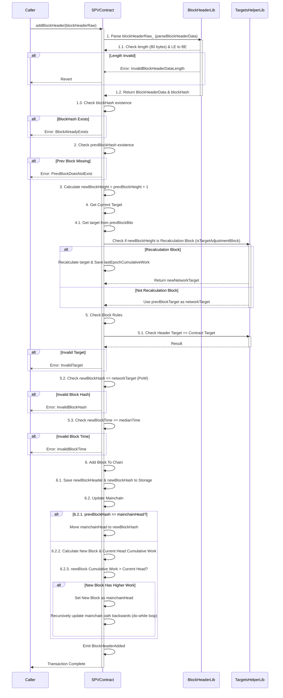
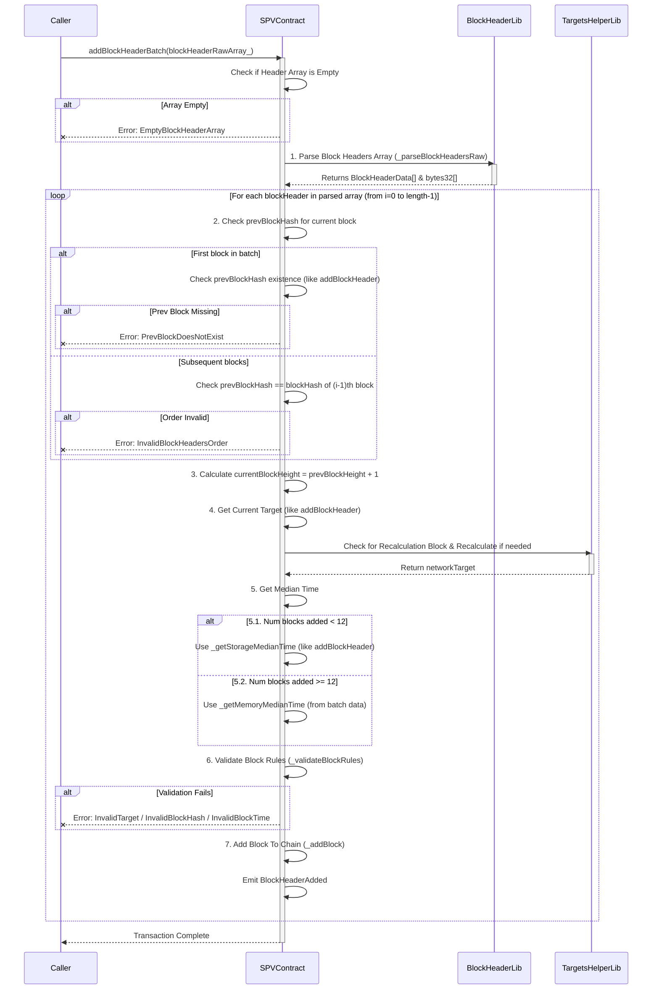

# 🛡️ SPV Contract: Bitcoin Light Client on EVM
Welcome to the **SPV Contract**, a robust and efficient Solidity implementation for verifying Bitcoin block headers directly on an EVM-compatible blockchain. This contract empowers dApps to act as a **Simplified Payment Verification (SPV)** client, allowing them to validate the existence and inclusion of Bitcoin transactions without needing to run a full Bitcoin node.

# ✨ Why this SPV Contract?
In the decentralized world, connecting different blockchain ecosystems securely is paramount. This SPV contract provides a trust-minimized bridge, enabling smart contracts on EVM chains to cryptographically verify the state of the Bitcoin blockchain. This opens doors for exciting use cases like:
- **Cross-chain bridges** for Bitcoin-backed assets
- **Light clients** for dApps that need to confirm Bitcoin transaction finality
- **Decentralized custodianship** solutions
- **Oracle services** for Bitcoin data on EVM

# 🚀 Key Features
- **Block Header Submission:** Efficiently add individual or batches of Bitcoin block headers to the contract.
- **Mainchain Tracking:** Automatically identifies and updates the "main" Bitcoin chain based on accumulated work.
- **Block Validation:** Verifies block headers against Bitcoin's consensus rules, including:
  - Proof-of-Work (target difficulty)
  - Block time validity (median time past)
  - Chain continuity (previous block hash)
- **Block Information Retrieval:** Query detailed information about any stored block, such as:
  - Its Merkle root
  - Its height
  - Its inclusion status in the mainchain
  - Its cumulative work (difficulty)
  - Its confirmation count relative to the mainchain head
- **Difficulty Adjustment:** Integrates Bitcoin's precise difficulty adjustment algorithm to accurately calculate current and future targets.

# ⚙️ How it Works (Under the Hood)
The contract operates by receiving raw Bitcoin block headers, which are then parsed and validated against Bitcoin's strict consensus rules.

1. **Header Parsing:** Raw 80-byte Bitcoin block headers are parsed into a structured *BlockHeaderData* format. This involves handling Bitcoin's unique little-endian byte ordering.
2. **Double SHA256 Hashing:** Each block header is double SHA256 hashed to derive its unique block hash, which is then byte-reversed for standard representation.
3. **Proof-of-Work Verification:** The calculated block hash is checked against the current network difficulty target (derived from the *bits* field in the header).
4. **Chain Extension & Reorganization:** New blocks are added to a data structure that allows for tracking multiple chains. When a new block extends a chain with higher cumulative work, the *mainchainHead* is updated, reflecting potential chain reorganizations.
5. **Difficulty Adjustment:** Every 2016 blocks, the contract calculates a new difficulty target based on the time taken to mine the preceding epoch. This ensures the 10-minute average block time is maintained.

# 📊 Flow Diagrams
These diagrams outline the step-by-step process for adding block headers to the SPV Contract.

### `addBlockHeader(bytes calldata blockHeaderRaw_)` Sequence Diagram



### `addBlockHeaderBatch(bytes[] calldata blockHeaderRawArr_)` Sequence Diagram

This function processes multiple block headers in a single transaction, iterating through the array and validating each sequentially.




# 📦 Contract Components
The solution is primarily composed of the main SPV contract and two essential helper libraries that manage the intricacies of Bitcoin's block structure and difficulty adjustments.

## SPVContract
This is the central contract that users will interact with. It serves as the primary interface for managing Bitcoin block headers on the EVM. It handles the core logic for adding and validating blocks, tracking the main Bitcoin chain, and providing querying functionalities. All custom errors and events related to the SPV operations are defined here, ensuring clear feedback and transparency during contract execution.

## BlockHeader Library
This is a pure utility library specifically designed to handle the low-level details of Bitcoin block headers. It's responsible for the precise parsing of raw 80-byte Bitcoin block header data into a structured format that Solidity can easily work with. Crucially, it manages the byte order conversions, translating Bitcoin's little-endian format to Solidity's big-endian, and vice-versa. It also provides the essential function for calculating the double SHA256 hash of a block header, which is fundamental for verifying Proof-of-Work.

## TargetsHelper Library
This library encapsulates all the complex mathematical and logical operations related to Bitcoin's difficulty targets. It provides functions to accurately calculate new difficulty targets based on elapsed time between blocks, ensuring the contract adheres to Bitcoin's dynamic difficulty adjustment rules. Additionally, it offers utilities for converting between the compact "bits" format (as found in Bitcoin block headers) and the full 256-bit target value, and it calculates the cumulative work associated with a given block or epoch, which is vital for determining the most valid chain.

# 💻 Dev Info
## Compilation
To compile the contracts, use the next script:

```bash
npm run compile
```

## Test
To run the tests, execute the following command:

```bash
npm run test
```

Or to see the coverage, run:

```bash
npm run coverage
```

## Local deployment
To deploy the contracts locally, run the following commands (in the different terminals):

```bash
npm run private-network
npm run deploy-localhost
```

## Bindings
The command to generate the bindings is as follows:

```bash
npm run generate-types
```
